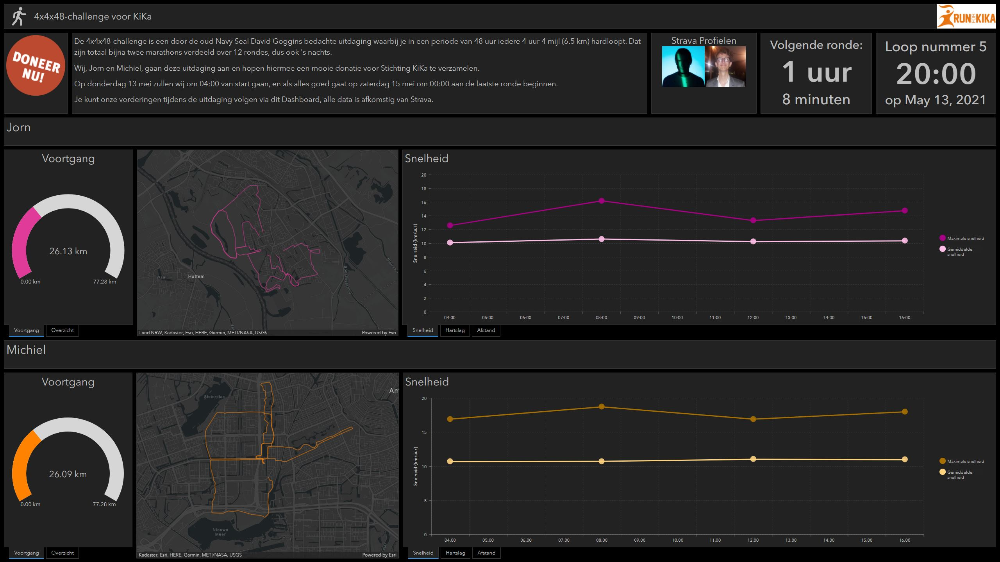
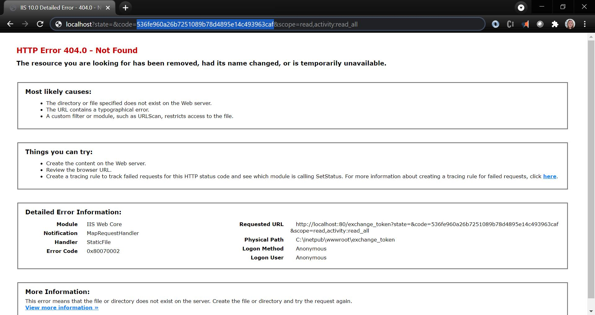

# Getting activities from Strava

It is possible to integrate other API's with ArcGIS using Python. When an API has geo-information this can be stored in a Feature Layer to be shown on a map or perform analysis on. One such an API that contains geo-information is the [Strava API](https://developers.strava.com/). Strava is used by athletes to store information about sports activities, such as running or cycling. Activities on Strava are shared with the public, to be able to see each others achievements. 

This sample shows how to connect to the Strava API and retrieve your own activities to store them in a Feature Layer. This can be used to create maps of your own activities or perform analysis on those activities.

The code for this sample was written to create a Dashboard to show the progress of two athletes during the 4x4x48 challenge. The challenge was designed by old Navy Seal David Goggins and consists of running a length of 4 miles (6.5 km) every 4 hours for a total of 48 hours. This results in a running distance of 77.28 km divided over 12 rounds. This challenge is designed to raise money for charity, in this case for the KiKa foundation to fund research on childhood cancer. 


<br>
<br>
View the Dashboard live:
[here](https://maartje-holtslag.maps.arcgis.com/apps/dashboards/e4f4d1ff69c44265b4ab5267a01f91ab)

## Getting access to the Strava API

To be able to retrieve your own information from Strava you have to register an API application first. This can be done on the [Strava website](https://www.strava.com/settings/api). For the `Authorization Callback Domain` set `localhost`, as this will be the URL you will be redirected to when authenticating yourself. 
<br>
<br>
Once you have created an application, you can retrieve an access token to communicate with the Strava API. Accesss token on Strava have a 'scope', this determines which actions can be performed with the given token. For using this script an access token with the `activity:read_all` scope is required. To get an authorization code to generate an access token, you have to replace the client id in the following URL with your own API applications' client id.
<br>
<br>
```https://www.strava.com/oauth/authorize?client_id=<yourClientID>&redirect_uri=http://localhost&response_type=code&scope=activity:read_all```
<br>
<br>
Next, paste this URL into your browser and grant access to your application. This will redirect you to your given redirect URL (in our case 'localhost') and in the new URL you will find the authorization code.
<br>
<br>

<br>
<br>
With this authorization code you can generate a new access token. Use a HTTP REST Client (for example Postman) to perform a POST to `https://www.strava.com/api/v3/oauth/token`. In this POST give the following params:
<br>
- `client_id` = `<yourClientID>`
- `client_secret` = `<yourClientSecret>`
- `code` = `<yourAuthorizationCode>`
- `grant_type` = authorization_code
<br>
This will give a JSON result with your new access token. Copy and Paste this JSON into the `yourToken.txt` file. 
